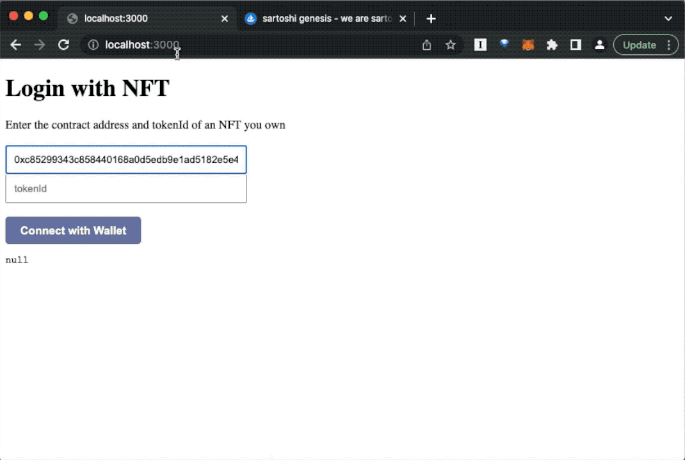
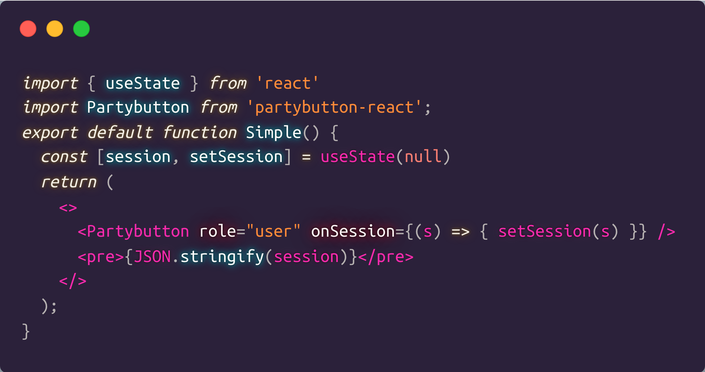
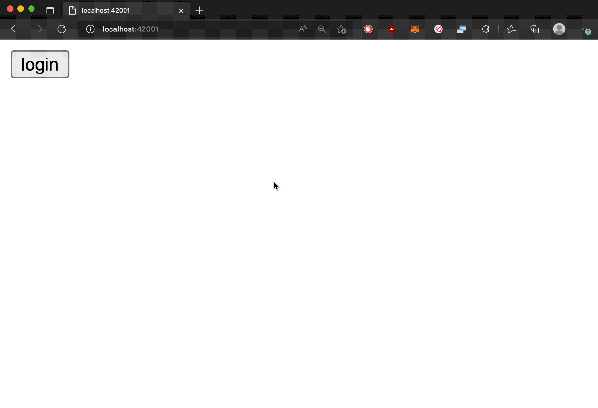
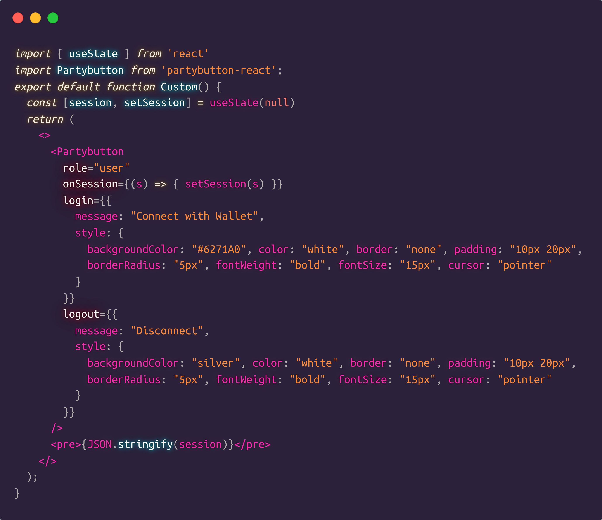
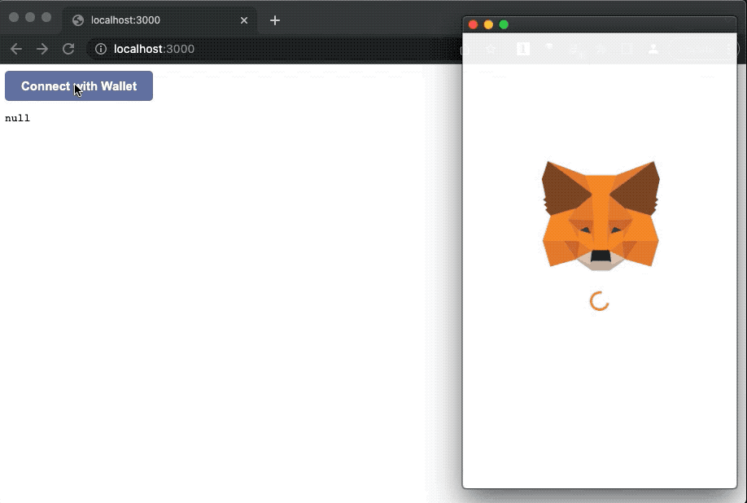
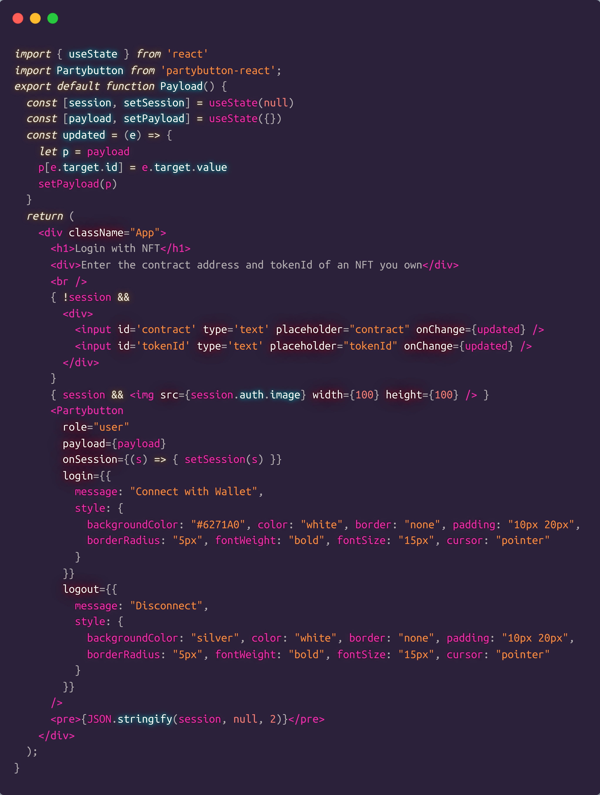
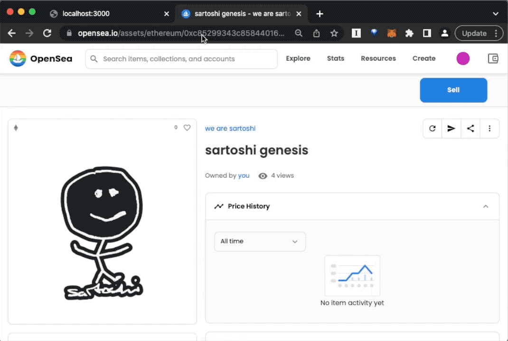

# Intro

Partybutton is like ["Facebook Connect"](https://developers.facebook.com/docs/facebook-login/web/login-button/), but fully decentralized and completely open.

Instead of authenticating and authorizing with Facebook, just paste one line of Partybutton componenet into your app to build apps that authenticate and authorize with the blockchain.

Most importantly, all this possible WITHOUT ever relying on a proprietary 3rd party service provider.



---

## What is it?

Partybutton is a drop-in button component for adding blockchain authentication to your app using [Privateparty](https://privateparty.papercorp.org/) blockchain auth framework.

1. **Simple:** One line of code to add persistent auth to your app.
2. **Powerful:** simple authentication, invite only apps, NFT based authorization, DAO members only apps, airdrops, and many more (see: https://privateparty.papercorp.org/docs/#/?id=what-can-you-build)
2. **Open source:** 100% open source with MIT license.
3. **No 3rd party reliance:** No SaaS company to rely on. It's a dead simple library you can use on your OWN machine, that works WITHOUT any 3rd party.


---

## Why?

Most blockchain web apps have the "connect with wallet" features already. So how is this different from what Partybutton does?

Normally "connect with wallet" means you are connecting your wallet to the frontend website so you can programmatically make blockchain transactions from the page.  This does NOT mean you are creating a persistent session with a server. In fact in most of those websites, there are no servers, and the web apps are just static pages.

But what if you want to build more sophisticated web apps with server side logic to provide much more interactive and seamless UX?

For example:

1. allow users to upload files ONLY if they're logged in
2. allow users to navigate around the website ONLY if they're logged in
3. serve custom content based on the current session

And Partybutton lets you do THAT, by connecting the wallet once, and then setting the cookie, so the server doesn't need to ask the users to prove their identity for every request.

**Partybutton is a blockchain authentication and authorization library for server side apps**.

---

## How it works

Partybutton is like ["Login with Facebook" button](https://developers.facebook.com/docs/facebook-login/web/login-button/), but with blockchains.

Instead of authenticating and authorizing users with Facebook, you authenticate with blockchain wallets, and authorize users using your own server-side logic.

Naturally there are two parts to it: a backend and a frontend.

1. **Backend:** [Privateparty](https://privateparty.papercorp.org/) is a simple server that lets you build this kind of backend easily. It's based on [express.js](https://expressjs.com/) so you can easily build any blockchain authenticated web app backends using JavaScript.
2. **Frontend:** **Partybutton** is the one-liner button component that lets you easily interact with a privateparty server.

---

## What it looks like

### 1. Instant integration






### 2. Fully customizable






### 3. Custom authentication





---

# Quickstart

To get started running some examples instantly, check out the demos below:

1. **Next.js demo:** https://github.com/privatepart/nextparty
2. **Vanilla React demo:** https://github.com/privatepart/reactparty

---

# React component

## Install

You can install the Partybutton react component with

```
npm install partybutton-react
```

## Syntax

```jsx
import Partybutton from 'partybutton-react';
<Partybutton
  role="user",
  onSession={(session) => { /* do something with the session */  }},
  login: {{
    message: "connect with wallet",
    style: {
      backgroundColor: "red",
      color: "white",
      padding: "10px"
    }
  }},
  logout: {{
    message: "disconnect",
    style: {
      backgroundColor: "blue",
      color: "white",
      padding: "10px"
    }
  }},
  payload: { ... },
  host: "http://localhost:3000",
  walletconnect: infuraId,
/>
```

- `role`: (required) the privateparty role to authenticate as ("user", "admin", or whatever you set up in the privateparty server)
- `onSession`: (required) triggered when first initialized, and also whenever the session changes (logs in or logs out)
- `login`: (optional) login button config
  - `message`: the login button message
  - `style`: a JSON object describing the stylesheet for the login button
- `logout` (optional) logout button config
  - `message`: the logout button message
  - `style`: a JSON object describing the stylesheet for the logout button
- `host`: (optional) the privateparty server host ONLY in case it's cross origin.
- `payload`: (optional) pass custom payload to the privateparty server for auth
- `walletconnect`: (optional) support mobile wallets with [walletconnect](https://docs.walletconnect.com/quick-start/dapps/web3-provider). Go to [Infura](https://infura.io), create a project, and get its ID, and paste it here. 

## Examples

### 1. Simple button

This is the simplest way to add a Partybutton component.

Here we create a state variable named `session`, and whenever the `<Partybutton />` component has a new session (the first time it loads, and whenever the user logs in or logs out), it will trigger the `onSession()` which calls the `setSession()`, which automatically updates the `<pre></pre>` tag content.

```jsx
import { useState } from 'react'
import Partybutton from 'partybutton-react';
export default function Simple() {
  const [session, setSession] = useState(null)
  return (
    <>
      <Partybutton role="user" onSession={(s) => { setSession(s) }} />
      <pre>{JSON.stringify(session)}</pre>
    </>
  );
}
```

### 2. Custom styled button

The default button has no stylesheet applied. But you can customize the button.

```jsx
import { useState } from 'react'
import Partybutton from 'partybutton-react';
export default function Custom() {
  const [session, setSession] = useState(null)
  return (
    <>
      <Partybutton
        role="user"
        onSession={(s) => { setSession(s) }}
        login={{
          message: "Connect with Wallet",
          style: {
            backgroundColor: "#6271A0", color: "white", border: "none", padding: "10px 20px",
            borderRadius: "5px", fontWeight: "bold", fontSize: "15px", cursor: "pointer"
          }
        }}
        logout={{
          message: "Disconnect",
          style: {
            backgroundColor: "silver", color: "white", border: "none", padding: "10px 20px",
            borderRadius: "5px", fontWeight: "bold", fontSize: "15px", cursor: "pointer"
          }
        }}
      />
      <pre>{JSON.stringify(session)}</pre>
    </>
  );
}
```

Note that you can style both the login button (using the `login` prop) and the logout button (using the `logout` prop)


### 3. Custom payload button

In the following example we have an additional form where the users can enter their NFT contract address and tokenId, in order to "login with NFT".


```jsx
import { useState } from 'react'
import Partybutton from 'partybutton-react';
export default function Payload() {
  const [session, setSession] = useState(null)
  const [payload, setPayload] = useState({})
  const updated = (e) => {
    let p = payload
    p[e.target.id] = e.target.value
    setPayload(p)
  }
  return (
    <div className="App">
      <h1>Login with NFT</h1>
      <div>Enter the contract address and tokenId of an NFT you own</div>
      <br />
      { !session &&
        <div>
          <input id='contract' type='text' placeholder="contract" onChange={updated} />
          <input id='tokenId' type='text' placeholder="tokenId" onChange={updated} />
        </div>
      }
      { session &&  }
      <Partybutton
        role="user"
        payload={payload}
        onSession={(s) => { setSession(s) }}
        login={{
          message: "Connect with Wallet",
          style: {
            backgroundColor: "#6271A0", color: "white", border: "none", padding: "10px 20px",
            borderRadius: "5px", fontWeight: "bold", fontSize: "15px", cursor: "pointer"
          }
        }}
        logout={{
          message: "Disconnect",
          style: {
            backgroundColor: "silver", color: "white", border: "none", padding: "10px 20px",
            borderRadius: "5px", fontWeight: "bold", fontSize: "15px", cursor: "pointer"
          }
        }}
      />
      <pre>{JSON.stringify(session, null, 2)}</pre>
    </div>
  );
}
```

1. The input fields automatically trigger the `updated()` method whenever there's an `onChange` event
2. The `updated()` method updates the `payload` state object.
3. The `<Partybutton />` component is automatically instantiated based on the custom payload, which is made up of the two attributes `contract` and `tokenId`.

This `payload` then gets passed to the Privateparty server as a custom payload object, which then can be used to authorize and set the session for the logged in user.

> Learn more about how this works here: https://privateparty.papercorp.org/docs/#/?id=_3-authenticate-with-custom-payload


### 4. Mobile wallet support

Let's support mobile wallets by integrating Walletconnect.

First go to [Infura](https://infura.io) and create a project. Then copy and paste the project ID to the `walletconnect` attribute when initializing:


```jsx
import { useState } from 'react'
import Partybutton from 'partybutton-react';
export default function Simple() {
  const [session, setSession] = useState(null)
  return (
    <>
      <Partybutton
        role="user"
        onSession={(s) => { setSession(s) }}
        walletconnect=YOUR_INFURA_ID
      />
      <pre>{JSON.stringify(session)}</pre>
    </>
  );
}
```

---

# Implementing Authorization Logic

You can implement all kinds of authorization logic.

1. NFT ownership based authorization
2. NFT balance based authorization
3. ERC20 balance based authorization
4. Any smart contract query based authorization


All of this authorization logic is taken care of in the backend side.

See [Privateparty docs](https://privateparty.papercorp.org/docs/#/?id=examples) to learn more.
